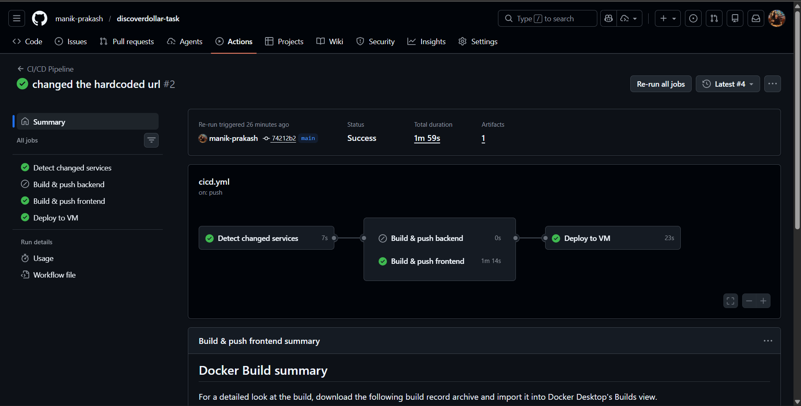
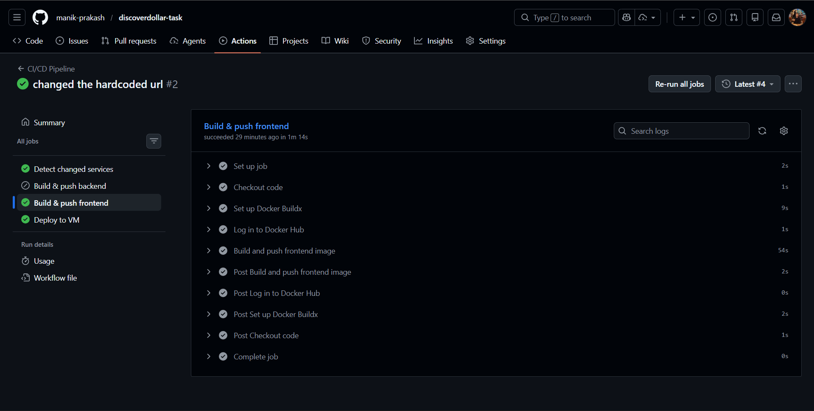
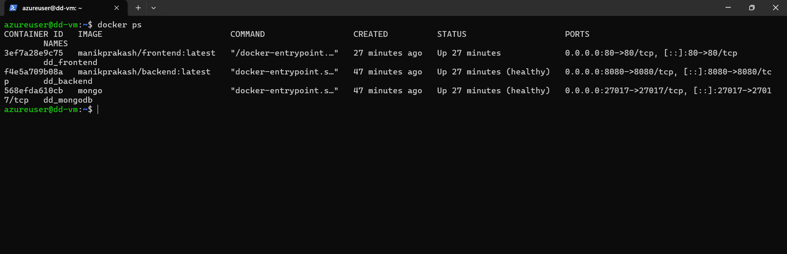
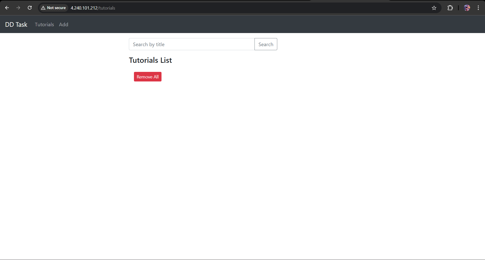
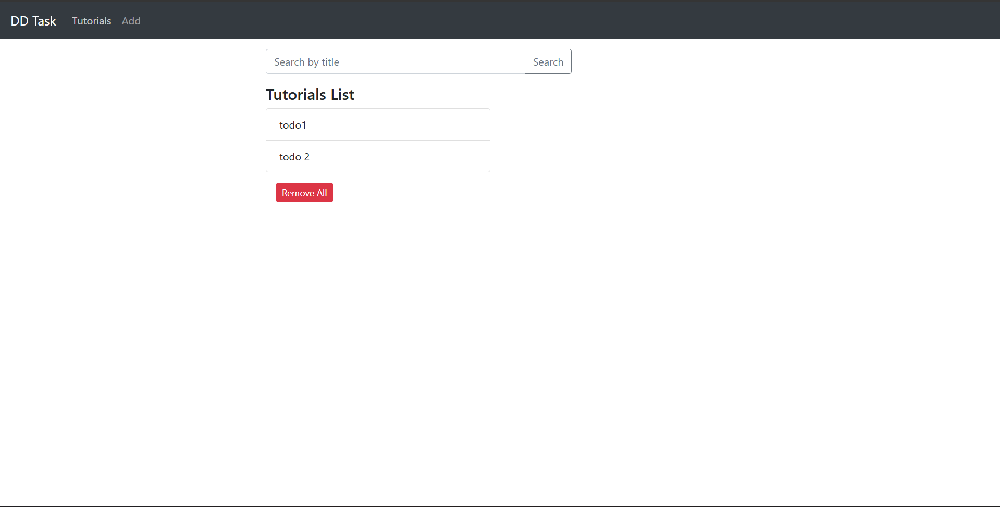
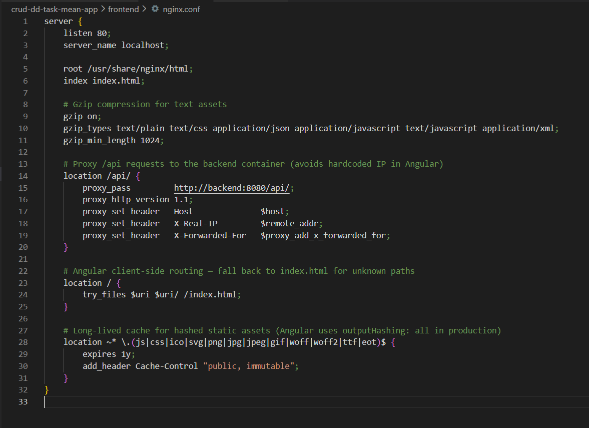
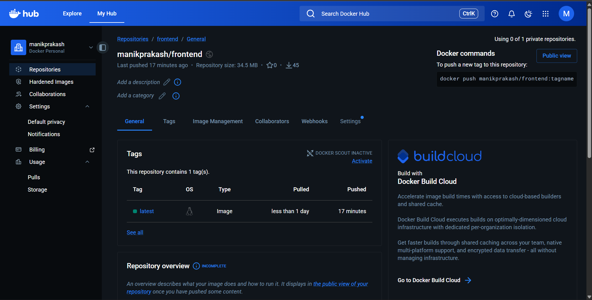
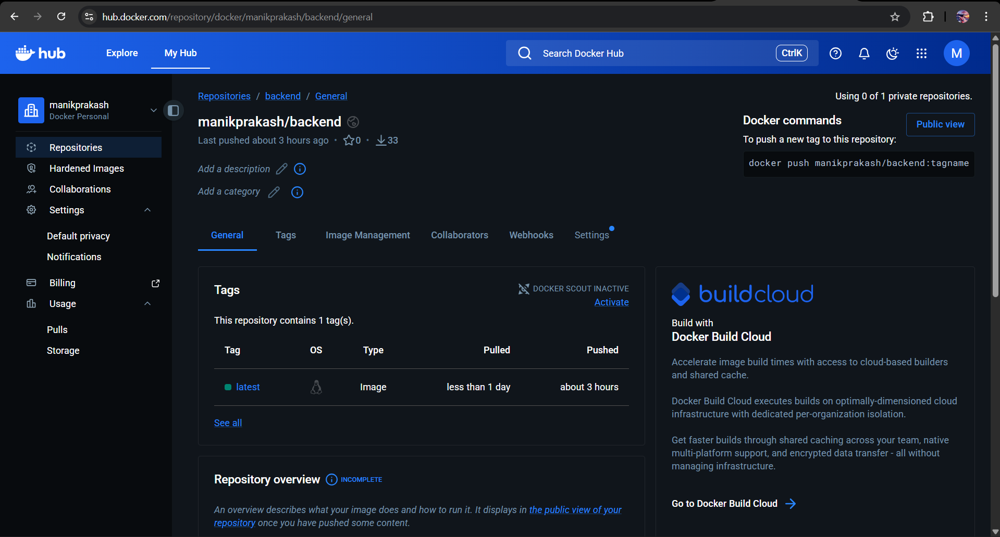

# MEAN Stack CRUD Application — DevOps Deployment

A full-stack CRUD application built with the **MEAN stack** (MongoDB, Express, Angular 15, Node.js), containerised with Docker, and deployed to an Azure VM via a fully automated GitHub Actions CI/CD pipeline.

Each tutorial has an ID, title, description, and published status. Users can create, retrieve, update, delete, and search tutorials by title.

---

## Table of Contents

- [Tech Stack](#tech-stack)
- [Project Structure](#project-structure)
- [Local Development Setup](#local-development-setup)
- [Docker Setup](#docker-setup)
- [CI/CD Pipeline](#cicd-pipeline)
- [VM Deployment](#vm-deployment)
- [Infrastructure Overview](#infrastructure-overview)
- [Screenshots](#screenshots)

---

## Tech Stack

| Layer     | Technology                        |
|-----------|-----------------------------------|
| Frontend  | Angular 15, Bootstrap 4, Nginx    |
| Backend   | Node.js, Express.js, dotenv       |
| Database  | MongoDB 7                         |
| Container | Docker, Docker Compose            |
| CI/CD     | GitHub Actions                    |
| Registry  | Docker Hub                        |
| Hosting   | Microsoft Azure VM (Ubuntu)       |

---

## Project Structure

```
├── backend/
│   ├── app/
│   │   ├── config/         # MongoDB connection config
│   │   ├── controllers/    # Route handler logic
│   │   ├── models/         # Mongoose schemas
│   │   └── routes/         # Express route definitions
│   ├── server.js           # App entry point
│   ├── Dockerfile
│   └── .dockerignore
├── frontend/
│   ├── src/
│   │   └── app/
│   │       ├── components/ # Add, List, Detail components
│   │       ├── models/     # Tutorial interface
│   │       └── services/   # HTTP service (API calls)
│   ├── nginx.conf          # Nginx config with /api proxy
│   ├── Dockerfile
│   └── .dockerignore
├── docker-compose.yml
└── .github/
    └── workflows/
        └── cicd.yml        # GitHub Actions pipeline
```

---

## Local Development Setup

### Prerequisites
- Node.js 22+
- MongoDB running locally
- Angular CLI (`npm install -g @angular/cli`)

### Backend

```bash
cd backend
npm install
node server.js
# Server runs at http://localhost:8080
```

To change the MongoDB URL, edit `app/config/db.config.js` or set a `MONGO_URL` environment variable in `.env`.

### Frontend

```bash
cd frontend
npm install
ng serve --port 8081
# App runs at http://localhost:8081
```

The Angular service (`src/app/services/tutorial.service.ts`) calls `/api/tutorials`. When running locally with `ng serve`, proxy it to the backend by adding a `proxy.conf.json` if needed.

---

## Docker Setup

### Build images locally

```bash
# From the project root (where docker-compose.yml is)
docker build -t manikprakash/backend:latest  ./backend
docker build -t manikprakash/frontend:latest ./frontend
```

### Run the full stack

```bash
docker compose up -d
```

This starts three containers:

| Container     | Image                       | Port  |
|---------------|-----------------------------|-------|
| dd_mongodb    | mongo                       | 27017 |
| dd_backend    | manikprakash/backend:latest | 8080  |
| dd_frontend   | manikprakash/frontend:latest| 80    |

### Useful commands

```bash
docker compose ps              # check container status
docker compose logs -f         # stream all logs
docker compose logs backend    # logs for one service
docker compose down            # stop and remove containers
docker compose down -v         # also delete the MongoDB volume
```

---

## CI/CD Pipeline

The pipeline is defined in [`.github/workflows/cicd.yml`](.github/workflows/cicd.yml) and runs automatically on every push to `main`.

### How it works

```
Push to main
     │
     ▼
detect-changes          ← checks which folders changed
     │
     ├──► build-backend   (only if backend/ changed)  → Docker Hub
     │
     └──► build-frontend  (only if frontend/ changed) → Docker Hub
                │
                ▼
            deploy         ← SSH into Azure VM, pull new images, restart
```

### Required GitHub Secrets

Go to **Settings → Secrets and variables → Actions** and add:

| Secret              | Description                                              |
|---------------------|----------------------------------------------------------|
| `DOCKERHUB_USERNAME`| Your Docker Hub username                                 |
| `DOCKERHUB_TOKEN`   | Docker Hub access token (Hub → Account → Security)       |
| `VM_HOST`           | Public IP of the Azure VM (set it to Static in Azure)    |
| `VM_USER`           | SSH username on the VM (e.g. `azureuser`)                |
| `VM_SSH_KEY`        | Full contents of your private SSH key (`~/.ssh/id_rsa`)  |

### Pipeline screenshot — CI/CD execution



### Pipeline screenshot — Docker image build and push



### Deployment screenshot — containers running on VM



### Application screenshot — working UI






### Nginx setup screenshot




## Docker Hub

Images are published at:
- `manikprakash/backend:latest`
- `manikprakash/frontend:latest`

### Docker Hub screenshot




